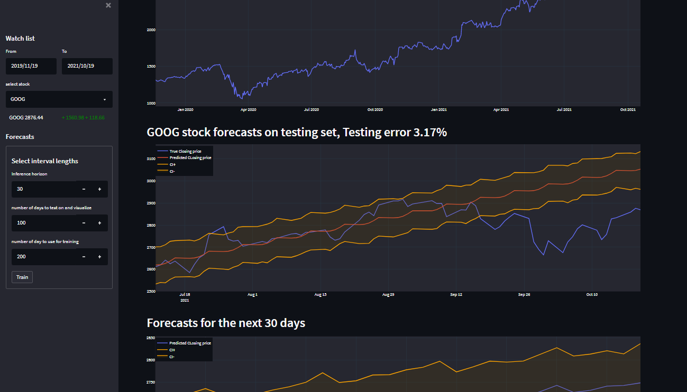

# Stock forecasts dashboard

     

A simple stock forecasting dashboard entirely written in python, features include:
* Visualize a stock closing price over a chosen perdiod of time, and the total change over the period. 
* Train, test and forecast with a facebook prophet model
Files included in this project:

`main.py` : this is the main script that defines the general outline of the dashboard.

`stock_object.py`: contains the Stock class, it handles stock data, forecasting model, and plotting. 

This is a streamlit app easy to deploy locally or in production to install downlaod the repo and run :

`pip install -r requirements.txt`

NOTE: if prophet fails to install as it did in my case, try installing it through conda:

`conda install -c conda-forge prophet`

Currently the stock choices are limited to `["AAPL", "GOOG", "MSFT", "GME", "FB",'TSLA']` if you are interested in a production level app contact me via linkedin or send me an email at hamzarabi3@gmail.com

